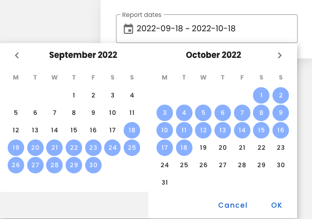

# Date range with two months for Vuetify v.2

Date range picker for Vuetify 2. To show 2 month for range selecting

## Preview



## Installation

```bash
npm i --save vuetifyjs-two-months-date-picker
```

OR

```bash
yarn add vuetifyjs-two-months-date-picker
```

Import and register component

**Global**

```js
import Vue from 'vue';
import VTwoMonthRangePicker from 'vuetifyjs-two-months-date-picker'

Vue.use(VTwoMonthRangePicker);

```

**Local**

```vue

<script>
import VTwoMonthRangePicker from 'vuetifyjs-two-months-date-picker';

export default {
    components: {VTwoMonthRangePicker}
}
</script>
```

## Properties

Coming soon...

## Events

Coming soon...

## License

Copyright © 2021-present [TDev Agency](https://github.com/tdev-agency)

[MIT](LICENSE)
